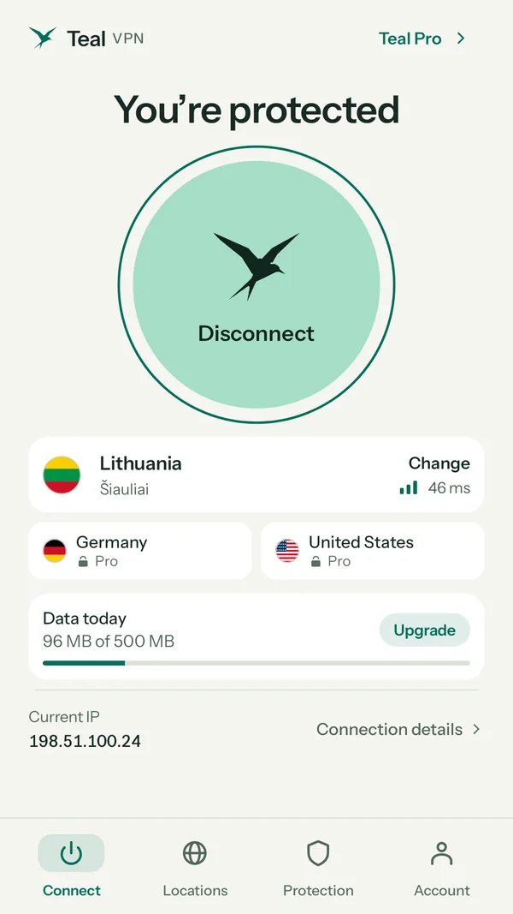
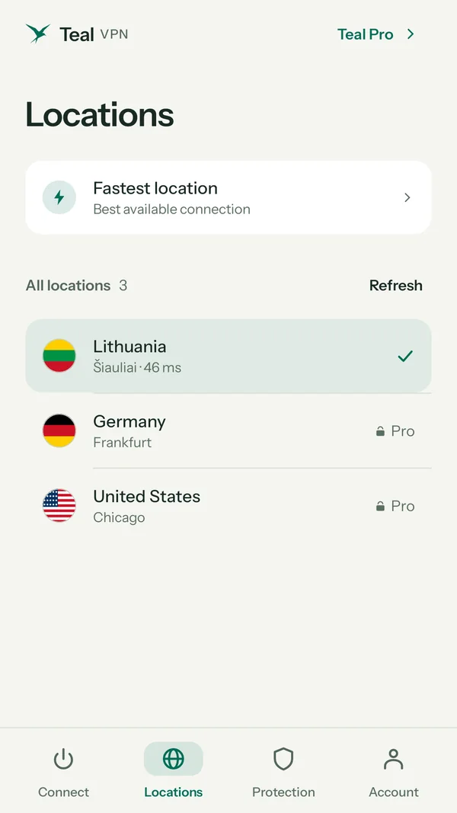
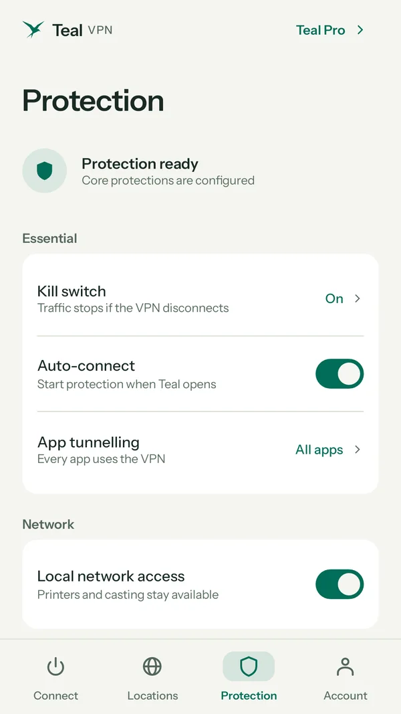
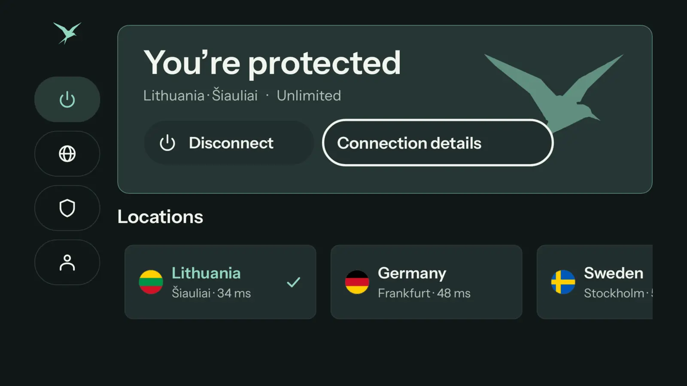

<p align="center">
  
</p>

<h1 align="center">Teal VPN for Android</h1>
<p align="center">Phones, tablets, Android TV and Chromebooks. Android 8.0 or newer.</p>

<p align="center">
  <a href="https://github.com/tealvpn/android/releases/latest/download/TealVPN.apk"></a>
  <a href="https://play.google.com/store/apps/details?id=com.tealvpn.client"></a>
</p>
<p align="center"><sub>Smaller downloads for one processor type: <a href="https://github.com/tealvpn/android/releases/latest/download/TealVPN-arm64-v8a.apk">most phones (arm64)</a> · <a href="https://github.com/tealvpn/android/releases/latest/download/TealVPN-armeabi-v7a.apk">older 32-bit phones</a> · <a href="https://github.com/tealvpn/android/releases/latest/download/TealVPN-x86_64.apk">Intel / AMD Chromebooks</a></sub></p>

<p align="center">
  
  
  
  
</p>

## Install

1. Download `TealVPN.apk` and open it.
2. If Android asks, allow your browser to install apps, then tap **Install**.
3. Open Teal VPN, sign in, and tap **Connect**.

## Check the file

Every release lists the SHA-256 of each file and carries a `.sha256` file next to it. Every APK is signed with our key; the signing certificate (SHA-256) is:

```
75:68:15:FB:27:4D:04:A3:8E:E8:C9:BD:CA:A7:1D:0A:AE:65:F3:C6:B1:0D:5F:1C:43:BA:F7:D0:DC:8E:8C:24
```

Check with `apksigner verify --print-certs TealVPN.apk`. An APK signed with any other key is not ours. Please don't install it.

## Updates

The app updates itself: it downloads only the file for your phone, checks it, and installs it with one tap. Your account and plan stay the same.

## Official links

[tealvpn.com](https://tealvpn.com/android) · [Your account](https://account.tealvpn.com) · [All Teal VPN downloads](https://github.com/tealvpn) · support@tealvpn.com

Download Teal VPN only from tealvpn.com, Google Play or this GitHub organization. This repository holds no source code, only the releases.
